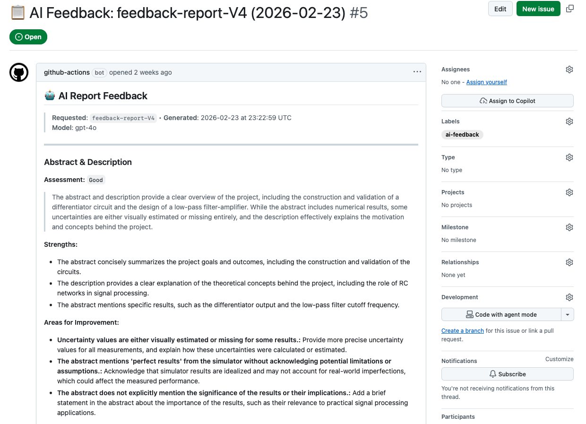
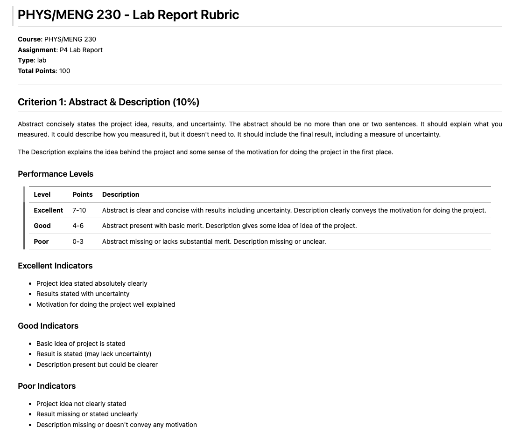
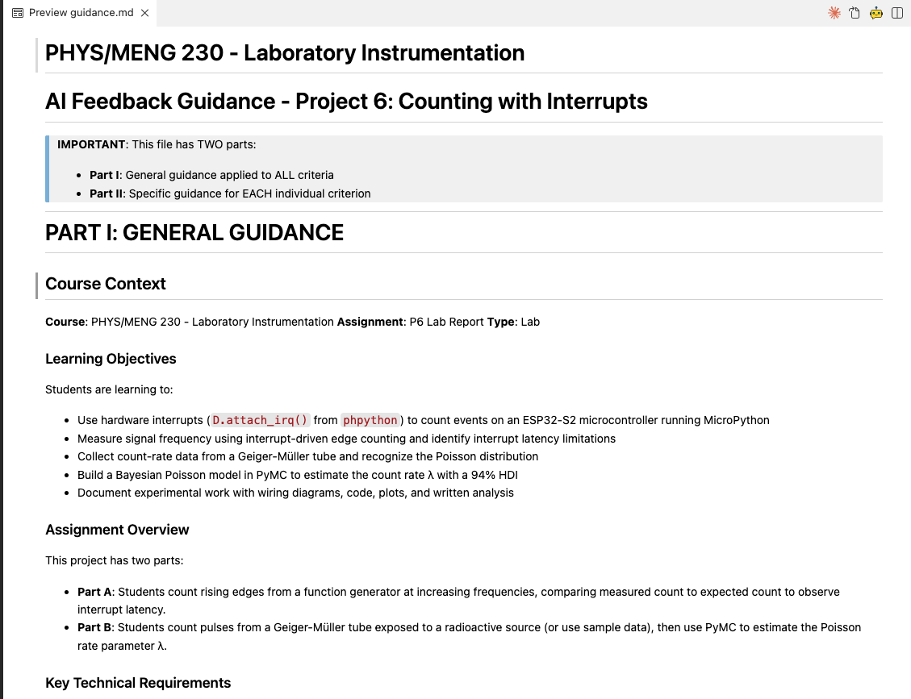

## The Problem {.center}

**Drop-box submissions:**

- Zip files, naming chaos, `v2_FINAL_fixed.docx`
- No visibility into *how* students worked
- Feedback arrives after the deadline — too late to use

. . .

> *What if the submission system also captured the process — and gave students a first pass of feedback while they could still act on it?*

. . .

**Fair warning:** I built this while teaching with it. What follows is one instructor's
experience, not a controlled trial.

---

## The Stack

```{=html}
<div style="display:flex; align-items:center; justify-content:center; gap:0.4em; font-size:0.8em; margin-top:1.5em;">
  <div style="background:#dbeafe; border:2px solid #3b82f6; border-radius:8px; padding:0.7em 1.2em; text-align:center; font-weight:600; line-height:1.3;">Repo per<br>Student</div>
  <span style="color:#888; font-size:1.8em;">→</span>
  <div style="background:#dbeafe; border:2px solid #3b82f6; border-radius:8px; padding:0.7em 1.2em; text-align:center; font-weight:600; line-height:1.3;">Codespaces</div>
  <span style="color:#888; font-size:1.8em;">→</span>
  <div style="background:#dbeafe; border:2px solid #3b82f6; border-radius:8px; padding:0.7em 1.2em; text-align:center; font-weight:600; line-height:1.3;">Quarto<br>Reports</div>
  <span style="color:#888; font-size:1.8em;">→</span>
  <div style="background:#dcfce7; border:2px solid #16a34a; border-radius:8px; padding:0.7em 1.2em; text-align:center; font-weight:600;">AI Feedback</div>
</div>
```

. . .

Students get their own repo from a template. Everything runs in a browser.

**All of it free with a GitHub Education account.**

. . .

::: {style="font-size:0.72em; color:#555; margin-top:0.6em;"}
I started on **GitHub Classroom**, which is being retired. Distribution now runs on a
small `gh` CLI extension — one command per assignment. *Nothing downstream changed.*
:::

---

## Codespaces: No Install, No Excuses

::: {.columns}
::: {.column width="52%"}
A pre-configured environment that runs **in the browser**.

- Python, Quarto, Typst — all pre-loaded
- Same environment for every student
- Works on Chromebooks, iPads, lab machines
- Defined by `.devcontainer/` in the template repo

*(We started on LaTeX and switched to Typst mid-semester — markedly
more robust for student-generated documents.)*

. . .

**Update the container once — everyone gets the fix.**

No more "it doesn't work on my machine."
:::
::: {.column width="48%"}
Students write a structured `index.qmd`:

```{.markdown}
## Abstract

::: {.callout-note}
Briefly state what you did, your
approach, and your main result with
an uncertainty estimate.
(Delete this box when you're done.)
:::
```

One source file renders to **HTML and PDF**, reproducibly, every time.
:::
:::

---

## Collaboration: The Process Becomes Visible

::: {.columns}
::: {.column width="50%"}
**What git history gives you that a drop-box can't:**

- *When* the work happened — not just that it did
- Whether it was one frantic night or three weeks
- What they tried and abandoned
:::
::: {.column width="50%"}
**And the conversation moves earlier:**

- Comment on a commit or open an issue *while* the report is being written
- Students respond by pushing a fix, not by emailing a new file
- The whole exchange stays attached to the work
:::
:::

. . .

> *The submission stops being an artifact you receive and starts being a process you can see.*

---

## AI Feedback: How It Works

Student asks for a read on their draft — from a menu, or the shell:

::: {.columns}
::: {.column width="52%"}
**Terminal → Run Task…**

- Render Report
- Check Report for Errors
- **Submit for AI Feedback**
:::
::: {.column width="48%"}
```{.bash}
./get-feedback.sh
```

Tagging through the GitHub web UI
works too — but it's clunky.
:::
:::

. . .

```{=html}
<div style="display:flex; align-items:center; justify-content:center; gap:0.5em; font-size:0.72em; margin-top:0.8em; flex-wrap:wrap;">
  <div style="background:#dbeafe; border:2px solid #3b82f6; border-radius:8px; padding:0.5em 1em; text-align:center; font-weight:600;">Tag pushed</div>
  <span style="color:#888; font-size:1.5em;">→</span>
  <div style="background:#dbeafe; border:2px solid #3b82f6; border-radius:8px; padding:0.5em 1em; text-align:center; font-weight:600;">Action parses<br><code>index.qmd</code></div>
  <span style="color:#888; font-size:1.5em;">→</span>
  <div style="background:#fef3c7; border:2px solid #d97706; border-radius:8px; padding:0.5em 1em; text-align:center; font-weight:600;">Each rubric criterion<br>analyzed separately</div>
  <span style="color:#888; font-size:1.5em;">→</span>
  <div style="background:#dcfce7; border:2px solid #16a34a; border-radius:8px; padding:0.5em 1em; text-align:center; font-weight:600;">Posted as a<br>GitHub Issue</div>
</div>
```

. . .

Criterion-by-criterion keeps the feedback focused and fits the token budget.

**~10 API calls per report · free via GitHub Models · no external API keys**

---

## AI Feedback: What The Student Gets

{style="max-height:790px; width:auto; display:block; margin:0 auto; box-shadow: 0 4px 16px rgba(0,0,0,0.3); border-radius: 6px;"}

. . .

Not "good job" — *"your abstract lacks an uncertainty estimate."*

---

## You Control What It Says

::: {.columns}
::: {.column width="50%"}
**`RUBRIC.md`** — your criteria, your weights

{style="max-height:620px; width:auto; display:block; margin:0 auto; box-shadow: 0 4px 12px rgba(0,0,0,0.3); border-radius: 6px;"}
:::
::: {.column width="50%"}
**`guidance.md`** — course context, common mistakes, tone

{style="max-height:620px; width:auto; display:block; margin:0 auto; box-shadow: 0 4px 12px rgba(0,0,0,0.3); border-radius: 6px;"}
:::
:::

. . .

Write them in Markdown. The system converts them for you.

**The AI applies *your* rubric — which also pulls students toward your actual criteria.**

---

## What Happened — With Caveats {.smaller}

I was building this while teaching with it. Rubrics changed, the PDF engine changed
mid-semester, the trigger changed in April. **This is an experience report, not a study.**

One term, three courses — **43 students, 440 repos, 191 requests.**
**Most students tried it** — **65% used it at least once.** What faded was how often
they came back:

```{=html}
<div style="display:flex; align-items:flex-end; justify-content:center; gap:2.5em; margin:0.5em 0 0.2em 0;">
  <div style="text-align:center;">
    <div style="background:#16a34a; width:3.2em; height:6.5em; border-radius:4px 4px 0 0;"></div>
    <div style="font-size:0.6em; margin-top:0.35em;"><b>0.61</b><br>Jan</div>
  </div>
  <div style="text-align:center;">
    <div style="background:#65a30d; width:3.2em; height:5.4em; border-radius:4px 4px 0 0;"></div>
    <div style="font-size:0.6em; margin-top:0.35em;"><b>0.51</b><br>Feb</div>
  </div>
  <div style="text-align:center;">
    <div style="background:#d97706; width:3.2em; height:4.0em; border-radius:4px 4px 0 0;"></div>
    <div style="font-size:0.6em; margin-top:0.35em;"><b>0.38</b><br>Mar</div>
  </div>
  <div style="text-align:center;">
    <div style="background:#dc2626; width:3.2em; height:2.3em; border-radius:4px 4px 0 0;"></div>
    <div style="font-size:0.6em; margin-top:0.35em;"><b>0.22</b><br>Apr</div>
  </div>
</div>
<div style="text-align:center; font-size:0.6em; color:#666;">feedback requests per assignment repo released</div>
```

. . .

Roughly the same number of assignments went out each month, so it isn't just that.
And the split wasn't apathy: **15 never tried it, 13 tried it once or twice,
15 made it a habit.** People didn't ignore it — they drifted away from it.

. . .

Why it tailed off, I genuinely don't know — novelty, friction, or busier weeks late
in the term. I didn't think to ask them, which in hindsight is the obvious thing I'd
do differently.

. . .

**One thing that did show up:** I offered an end-of-term revision window. Students used
it at about the same rate regardless of feedback use — but **how much** revision they
needed differed. Of items that came back, students who'd never used feedback needed a
*second* revision pass 16% of the time. For heavy feedback users: **zero out of 56.**

---

## Where I'd Go Next

::: {.columns}
::: {.column width="50%"}
**Lower the friction**
<br>The trigger is now a menu item in the editor rather than a shell command.
Shipped in April — no verdict yet.

**Require one round, once**
<br>Build a single feedback request into one early assignment. Ten minutes of
student time; might reach the group that never opted in.
:::
::: {.column width="50%"}
**Ask them why**
<br>Three questions at the end of term would have told me more than all of my
log-digging did.

**Point it at me instead**
<br>Same engine run in batch — triage for *my* grading rather than a
student-facing tool.
:::
:::

. . .

**To try it:** GitHub Education account (free) → a course org → a template repo with
`index.qmd` + `.devcontainer/` + `.github/feedback/`

`UINDY-INSTRUCTORS/gh-rba` · `UINDY-INSTRUCTORS/ai-feedback-system` · `UINDY-INSTRUCTORS/batch_quarto_reports`

**spicklemire@uindy.edu** · *Questions?*

---

## Backup: The Courses {visibility="uncounted"}

**Spring 2026 — the numbers on slide 9 come from these three (rosters verified against Brightspace):**

::: {.columns}
::: {.column width="50%"}
**PHYS/ENGR 280** — Scientific Computing
<br>12 projects: Euler method → intro ML
<br>*169 repos, 13 students*

**PHYS/MENG 230** — Lab Instrumentation
<br>9 labs; checks error bars and units on every plot
<br>*249 repos, 24 students*
:::
::: {.column width="50%"}
**EENG 340** — Interfacing Laboratory
<br>Reads firmware alongside the report
<br>*35 repos, 6 students*
:::
:::

. . .

**Earlier, and a different animal:** EENG 320 (Electronics) ran in Fall 2025 with a
*push* model — I generated feedback and posted it, one round per student per lab.
The tag-triggered, student-initiated version was built over winter break. Same engine,
very different question about who's driving.

---

## Backup: Revision {visibility="uncounted"}

627 annotated grading files across three courses. Two different questions:

::: {.columns}
::: {.column width="50%"}
**Did they revise?** — flat

| requests | n | revised |
|---|---|---|
| 0 | 15 | 36.7% |
| 1–2 | 13 | 43.4% |
| 3+ | 15 | 35.5% |

Everyone took the window at about the same rate.
:::
::: {.column width="50%"}
**How much revision?** — not flat

| requests | items | needed 2nd pass |
|---|---|---|
| 0 | 55 | **16%** |
| 1–2 | 61 | 3% |
| 3+ | 56 | **0%** |

Zero of 56, against a 16% base rate.
:::
:::

. . .

Consistent with feedback front-loading the fixes — students still revised, but converged
in one pass. **Small numbers (9, 2, 0 items) and the same self-selection problem**: careful
students both seek feedback and revise efficiently. Suggestive, not conclusive.

---

## Backup: Did It Help? {visibility="uncounted"}

I checked against actual gradebook scores. The raw gap looks big — and it's mostly an artifact.

| feedback requests | n | **submitted** | **score when submitted** |
|---|---|---|---|
| 0 | 15 | 78% | 92% |
| 1–2 | 12 | 86% | 95% |
| 3+ | 15 | 96% | 97% |

. . .

Raw report averages differ by ~18 points. But most of that is **submission behavior** —
students who skip an assignment don't request feedback on the assignment they're skipping.
Condition on actually turning it in and the gap falls to about 5 points, in a range already
near ceiling.

So: engaged students use the tool. I knew that. It isn't evidence the tool
produced the engagement, and I'm not going to claim it does.
